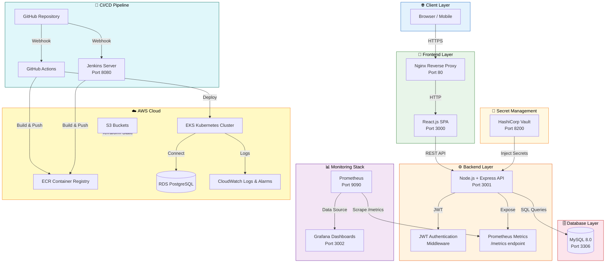
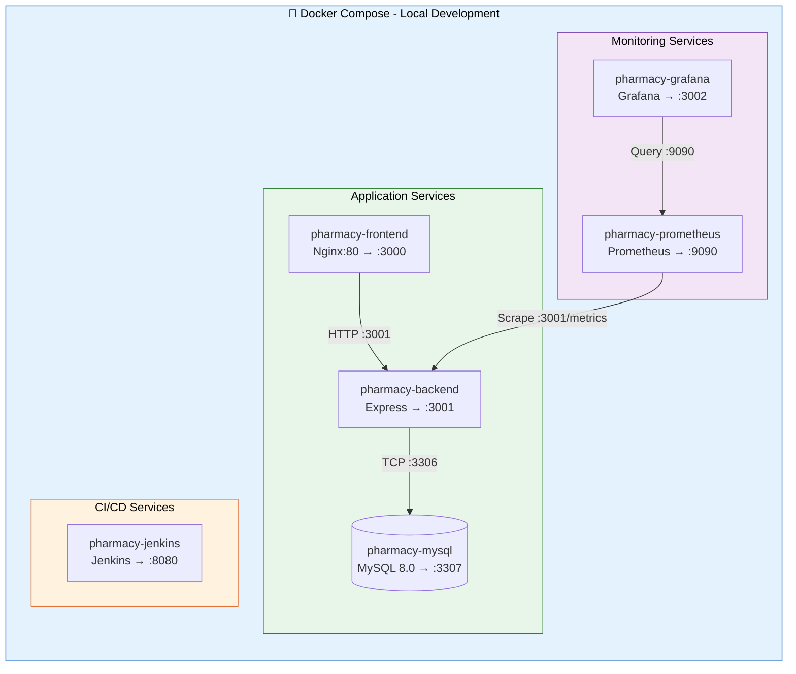
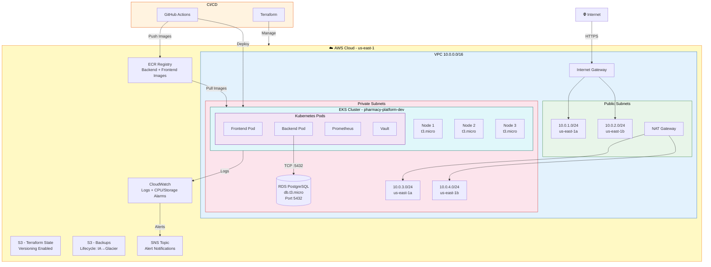
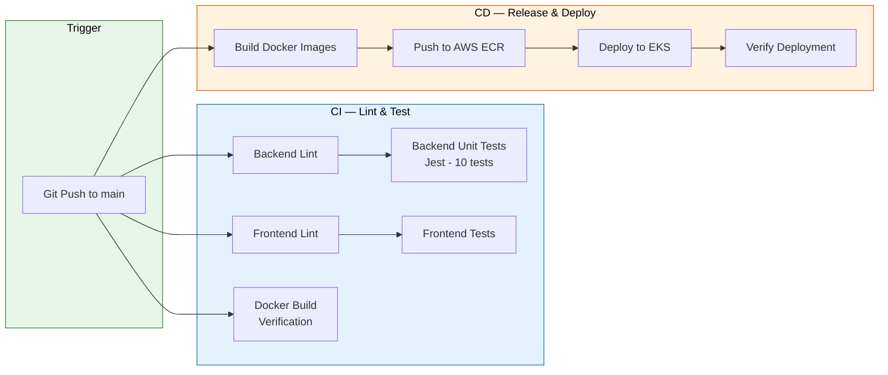

# Pharmacy Platform — Architecture & Deployment Diagrams

## 1. System Architecture Diagram

---

## 2. Deployment Diagram — Local (Docker Compose)

---

## 3. Deployment Diagram — AWS (Production)

---

## 4. CI/CD Pipeline Flow

---

## How to View These Diagrams

These are **Mermaid diagrams**. To render them:

1. **GitHub** — Push this file to your repo. GitHub renders Mermaid natively in markdown.
2. **VS Code** — Install the "Markdown Preview Mermaid Support" extension.
3. **Online** — Paste the mermaid code blocks at https://mermaid.live
