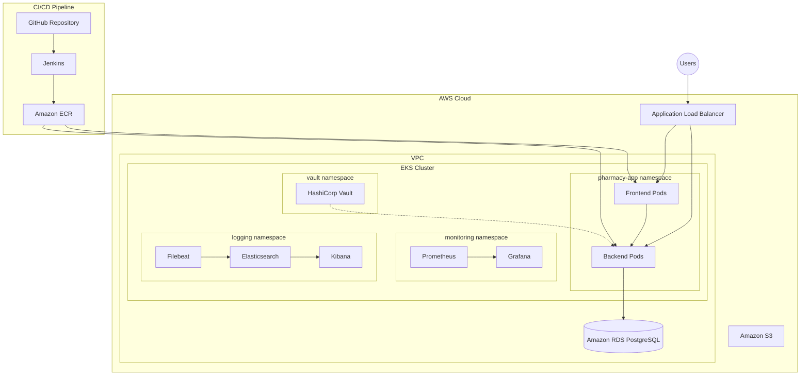

<![CDATA[# System Architecture

## Overview

The Pharmacy Inventory & Prescription Management Platform is built as a cloud-native, microservices-ready application deployed on **Amazon Web Services (AWS)**. The architecture prioritizes high availability, horizontal scalability, security-in-depth, and operational observability. All application workloads run as containerized pods on an **Amazon EKS** Kubernetes cluster, with supporting infrastructure managed through **Terraform** and continuous delivery orchestrated by **Jenkins**.

---

## Architecture Diagram



---

## Component Descriptions

### CI/CD Pipeline

| Component              | Description |
| ---------------------- | ----------- |
| **GitHub Repository**  | Central source of truth for all application code, Kubernetes manifests, Terraform configurations, and pipeline definitions. Branch protection rules enforce code review before merge. |
| **Jenkins**            | Declarative pipeline server that orchestrates the full build-test-deploy lifecycle. Stages include checkout, dependency install, unit tests, Docker image builds, ECR push, EKS deployment, and smoke tests. See [`jenkins/Jenkinsfile`](../jenkins/Jenkinsfile). |
| **Amazon ECR**         | Managed Docker container registry storing versioned images for `pharmacy-backend` and `pharmacy-frontend`. Images are tagged with the short Git commit SHA for traceability. |

### Application Layer (`pharmacy-app` namespace)

| Component          | Description |
| ------------------ | ----------- |
| **Frontend Pods**  | React 18 single-page application served by Nginx. Communicates with the backend exclusively through the REST API. Deployed as a Kubernetes Deployment with 2+ replicas for high availability. |
| **Backend Pods**   | Node.js 20 / Express 4 API server handling authentication (JWT), CRUD operations for medicines and prescriptions, and dashboard statistics. Exposes `/health`, `/ready`, and `/metrics` endpoints. Configured with liveness and readiness probes for zero-downtime deployments. |

### Data Layer

| Component                   | Description |
| --------------------------- | ----------- |
| **Amazon RDS PostgreSQL**   | Managed relational database service running PostgreSQL 15. Provides automated backups, Multi-AZ failover, encryption at rest (AES-256 via AWS KMS), and encryption in transit (TLS). The backend uses **Knex.js** as the query builder and migration tool. |
| **Amazon S3**               | Object storage for Terraform state files (with versioning and DynamoDB state locking), application backups, and static assets. |

### Monitoring (`monitoring` namespace)

| Component       | Description |
| --------------- | ----------- |
| **Prometheus**  | Time-series database that scrapes metrics from backend pods via annotated endpoints (`/metrics` on port 3001). Collects custom application metrics (HTTP request duration, active requests, low-stock gauge) alongside standard Kubernetes metrics. |
| **Grafana**     | Visualization and dashboarding platform connected to Prometheus as a data source. Pre-configured dashboards display API latency, error rates, pod resource utilization, and inventory health indicators. Alert rules trigger notifications for critical conditions. |

### Logging (`logging` namespace)

| Component          | Description |
| ------------------ | ----------- |
| **Filebeat**       | Lightweight log shipper deployed as a DaemonSet on every EKS node. Collects container logs from `/var/log/containers/` and forwards structured JSON (Pino) log entries to Elasticsearch. |
| **Elasticsearch**  | Distributed search and analytics engine indexing all application and infrastructure logs. Logs are indexed under the `filebeat-*` pattern with daily rotation. |
| **Kibana**         | Web-based interface for exploring, visualizing, and analyzing logs stored in Elasticsearch. Saved searches and dashboards provide quick access to backend error logs, slow queries, and authentication events. |

### Secrets Management (`vault` namespace)

| Component             | Description |
| --------------------- | ----------- |
| **HashiCorp Vault**   | Centralized secrets management platform storing sensitive credentials (database passwords, JWT secrets, API keys) at the `secret/pharmacy-app` KV v2 path. Integrates with Kubernetes via the **Vault Agent Injector**, which automatically injects secrets into pod containers as files. Kubernetes auth method ensures only authorized service accounts can access specific secret paths. |

### Networking & Ingress

| Component                        | Description |
| -------------------------------- | ----------- |
| **Application Load Balancer**    | AWS ALB provisioned by the AWS Load Balancer Controller. Routes external HTTPS traffic to frontend and backend services based on path-based routing rules. Terminates TLS using certificates managed by AWS Certificate Manager (ACM). |

---

## Security Considerations

### Network Security

- **VPC Isolation** — All resources run within a dedicated VPC with public and private subnets across multiple Availability Zones.
- **Security Groups** — Fine-grained firewall rules restrict traffic:
  - ALB accepts inbound HTTPS (443) from the internet.
  - EKS worker nodes accept traffic only from the ALB and within the VPC.
  - RDS accepts connections only from the EKS worker node security group on port 5432.
- **Network Policies** — Kubernetes NetworkPolicies restrict inter-namespace communication. Only the `pharmacy-app` namespace can communicate with the `vault` namespace.

### Application Security

- **Helmet.js** — Sets secure HTTP headers (X-Content-Type-Options, Strict-Transport-Security, X-Frame-Options, etc.).
- **CORS** — Configured to allow requests only from trusted origins.
- **Input Validation** — `express-validator` sanitizes and validates all API inputs.
- **JWT Authentication** — Stateless token-based auth with configurable expiration (default: 24h). Passwords hashed with **bcryptjs** (salt rounds: 10).

### Secrets Management

- **Vault KV v2** — Secrets are versioned and audited. Dynamic database credentials can be enabled for enhanced security.
- **Kubernetes Secrets** — Used as a fallback; values are base64-encoded and should be managed via `kubectl` or an external secrets operator.
- **Vault Agent Injector** — Automatically mounts secrets into pod filesystems, eliminating the need for environment variable exposure.

### Infrastructure Security

- **RDS Encryption** — Data encrypted at rest using AWS KMS; in-transit encryption enforced via TLS.
- **S3 Bucket Policies** — Terraform state bucket restricted to the CI/CD IAM role with versioning enabled.
- **IAM Least Privilege** — Each component (Jenkins, EKS nodes, Lambda) operates with the minimum required permissions.
- **EKS RBAC** — Kubernetes Role-Based Access Control limits pod permissions per namespace.

---

## Networking

### VPC Layout

```
┌─────────────────────────────────────────────────────────┐
│                    VPC (10.0.0.0/16)                     │
│                                                         │
│  ┌─────────────────────┐  ┌─────────────────────┐      │
│  │   Public Subnet AZ-a │  │   Public Subnet AZ-b │      │
│  │   10.0.1.0/24        │  │   10.0.2.0/24        │      │
│  │   ┌───────────────┐  │  │   ┌───────────────┐  │      │
│  │   │  NAT Gateway  │  │  │   │  NAT Gateway  │  │      │
│  │   └───────────────┘  │  │   └───────────────┘  │      │
│  │   ┌───────────────┐  │  │                       │      │
│  │   │     ALB       │  │  │                       │      │
│  │   └───────────────┘  │  │                       │      │
│  └─────────────────────┘  └─────────────────────┘      │
│                                                         │
│  ┌─────────────────────┐  ┌─────────────────────┐      │
│  │  Private Subnet AZ-a │  │  Private Subnet AZ-b │      │
│  │  10.0.10.0/24        │  │  10.0.20.0/24        │      │
│  │  ┌───────────────┐   │  │  ┌───────────────┐   │      │
│  │  │  EKS Worker   │   │  │  │  EKS Worker   │   │      │
│  │  │  Nodes        │   │  │  │  Nodes        │   │      │
│  │  └───────────────┘   │  │  └───────────────┘   │      │
│  └─────────────────────┘  └─────────────────────┘      │
│                                                         │
│  ┌─────────────────────┐  ┌─────────────────────┐      │
│  │  Database Subnet AZ-a│  │  Database Subnet AZ-b│      │
│  │  10.0.100.0/24       │  │  10.0.200.0/24       │      │
│  │  ┌───────────────┐   │  │  ┌───────────────┐   │      │
│  │  │  RDS Primary  │   │  │  │  RDS Standby  │   │      │
│  │  └───────────────┘   │  │  └───────────────┘   │      │
│  └─────────────────────┘  └─────────────────────┘      │
└─────────────────────────────────────────────────────────┘
```

### Subnet Strategy

| Subnet Type    | CIDR Range       | Purpose | Internet Access |
| -------------- | ---------------- | ------- | --------------- |
| **Public**     | `10.0.1.0/24`, `10.0.2.0/24`     | ALB, NAT Gateways | Direct (IGW) |
| **Private**    | `10.0.10.0/24`, `10.0.20.0/24`   | EKS worker nodes, application pods | Outbound via NAT |
| **Database**   | `10.0.100.0/24`, `10.0.200.0/24` | RDS instances (Multi-AZ) | None |

### Traffic Flow

1. **Inbound** — Users → Route 53 → ALB (public subnet) → EKS Service → Backend/Frontend pods (private subnet).
2. **Database** — Backend pods → RDS endpoint (database subnet) via security group allowlist.
3. **Outbound** — Pods → NAT Gateway (public subnet) → Internet (for pulling images, external API calls).
4. **Monitoring** — Prometheus scrapes pod metrics internally via Kubernetes Service discovery.
5. **Logging** — Filebeat (DaemonSet) → Elasticsearch (ClusterIP service) — all traffic stays within the cluster.
]]>
