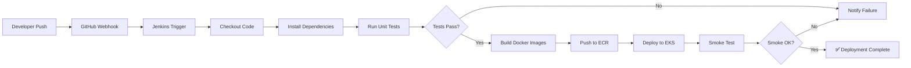

<
- [CI/CD Pipeline Flow](#cicd-pipeline-flow)
- [Infrastructure Setup (Terraform)](#infrastructure-setup-terraform)
- [Helm Chart Installations](#helm-chart-installations)
- [Application Deployment](#application-deployment)
- [Monitoring Setup](#monitoring-setup)
- [Logging Setup](#logging-setup)
- [Vault Setup](#vault-setup)

---

## Prerequisites

Before proceeding with deployment, ensure the following tools and access are configured:

| Requirement        | Version | Verification Command |
| ------------------ | ------- | -------------------- |
| AWS CLI            | 2.x     | `aws --version` |
| kubectl            | 1.28+   | `kubectl version --client` |
| Terraform          | 1.6+    | `terraform --version` |
| Helm               | 3.13+   | `helm version` |
| Docker             | 24.x    | `docker --version` |
| Node.js            | 20.x    | `node --version` |
| AWS IAM permissions | —      | Admin or scoped permissions for EKS, ECR, RDS, VPC, S3, IAM |

> **Note:** Ensure your AWS credentials are configured via `aws configure` or environment variables before running any commands.

---

## CI/CD Pipeline Flow

The Jenkins pipeline automates the complete build-test-deploy lifecycle:



### Pipeline Stages

| Stage | Description |
| ----- | ----------- |
| **Checkout** | Pulls the latest code from the GitHub repository. |
| **Install & Test Backend** | Runs `npm ci` and `npm test` in `app/backend/`. |
| **Install & Test Frontend** | Runs `npm ci` and `npm test` in `app/frontend/`. |
| **Build Docker Images** | Builds backend and frontend images tagged with the Git commit SHA (first 7 characters). |
| **Push to ECR** | Authenticates with Amazon ECR and pushes both images. |
| **Deploy to EKS** | Updates kubeconfig, applies Kustomize manifests, sets new image tags, and waits for rollout completion. |
| **Smoke Test** | Curls the backend `/health` endpoint to verify the deployment is serving traffic. |

---

## Infrastructure Setup (Terraform)

### 1. Initialize Terraform Backend

First, ensure the S3 bucket and DynamoDB table for state management exist:

```bash
# Create S3 bucket for Terraform state (one-time setup)
aws s3api create-bucket \
  --bucket <YOUR_TERRAFORM_STATE_BUCKET> \
  --region us-east-1

# Enable versioning
aws s3api put-bucket-versioning \
  --bucket <YOUR_TERRAFORM_STATE_BUCKET> \
  --versioning-configuration Status=Enabled

# Create DynamoDB table for state locking
aws dynamodb create-table \
  --table-name <YOUR_LOCK_TABLE_NAME> \
  --attribute-definitions AttributeName=LockID,AttributeType=S \
  --key-schema AttributeName=LockID,KeyType=HASH \
  --billing-mode PAY_PER_REQUEST \
  --region us-east-1
```

### 2. Configure Variables

Update `terraform/variables.tf` with your environment-specific values:

```hcl
variable "aws_region" {
  default = "us-east-1"   # TODO: Set your AWS region
}

variable "cluster_name" {
  default = "pharmacy-platform-dev"   # TODO: Set your EKS cluster name
}

variable "db_name" {
  default = "pharmacy_db"   # TODO: Set your database name
}

variable "db_username" {
  default = "pharmacy_user"   # TODO: Set your database username
}

# NEVER commit real passwords — use terraform.tfvars (gitignored) or environment variables
variable "db_password" {
  sensitive = true
}
```

### 3. Run Terraform

```bash
cd terraform/

# Initialize providers and backend
terraform init

# Preview the execution plan
terraform plan -out=tfplan

# Apply the plan
terraform apply tfplan
```

### 4. Expected Resources Created

| Resource | Description |
| -------- | ----------- |
| VPC + Subnets | Multi-AZ VPC with public, private, and database subnets |
| EKS Cluster | Managed Kubernetes control plane with worker node group |
| RDS PostgreSQL | Multi-AZ database instance with automated backups |
| ALB | Application Load Balancer for ingress traffic |
| ECR Repositories | Container registries for backend and frontend images |
| S3 Bucket | Terraform state storage |
| IAM Roles | EKS node role, ALB controller role, Jenkins deployment role |

---

## Helm Chart Installations

### Prometheus & Grafana (Monitoring Stack)

```bash
# Add Helm repository
helm repo add prometheus-community https://prometheus-community.github.io/helm-charts
helm repo update

# Install with custom values
helm install prometheus prometheus-community/kube-prometheus-stack \
  --namespace monitoring \
  --create-namespace \
  --set grafana.adminPassword="<YOUR_GRAFANA_PASSWORD>" \
  --set prometheus.prometheusSpec.serviceMonitorSelectorNilUsesHelmValues=false \
  --set prometheus.prometheusSpec.podMonitorSelectorNilUsesHelmValues=false \
  --set grafana.service.type=LoadBalancer \
  --set prometheus.prometheusSpec.scrapeInterval=15s \
  --set prometheus.prometheusSpec.evaluationInterval=15s
```

### Elasticsearch, Kibana & Filebeat (ELK Stack)

```bash
# Add Helm repository
helm repo add elastic https://helm.elastic.co
helm repo update

# Install Elasticsearch
helm install elasticsearch elastic/elasticsearch \
  --namespace logging \
  --create-namespace \
  --set replicas=2 \
  --set minimumMasterNodes=1 \
  --set resources.requests.memory="1Gi" \
  --set resources.limits.memory="2Gi" \
  --set volumeClaimTemplate.resources.requests.storage="30Gi" \
  --set persistence.enabled=true

# Install Kibana
helm install kibana elastic/kibana \
  --namespace logging \
  --set service.type=LoadBalancer \
  --set elasticsearchHosts="http://elasticsearch-master:9200"

# Install Filebeat
helm install filebeat elastic/filebeat \
  --namespace logging \
  --set filebeatConfig.filebeat\\.yml="$(cat <<'EOF'
filebeat.inputs:
  - type: container
    paths:
      - /var/log/containers/*.log
    processors:
      - add_kubernetes_metadata:
          host: ${NODE_NAME}
          matchers:
            - logs_path:
                logs_path: "/var/log/containers/"

output.elasticsearch:
  hosts: ["http://elasticsearch-master:9200"]
  index: "filebeat-%{+yyyy.MM.dd}"
EOF
)"
```

### HashiCorp Vault

```bash
# Add Helm repository
helm repo add hashicorp https://helm.releases.hashicorp.com
helm repo update

# Install Vault with integrated storage and injector enabled
helm install vault hashicorp/vault \
  --namespace vault \
  --create-namespace \
  --set server.ha.enabled=true \
  --set server.ha.replicas=3 \
  --set server.ha.raft.enabled=true \
  --set injector.enabled=true \
  --set injector.replicas=2 \
  --set ui.enabled=true \
  --set ui.serviceType=LoadBalancer
```

---

## Application Deployment

### 1. Build and Push Docker Images

```bash
# Set variables
export AWS_ACCOUNT_ID="<YOUR_AWS_ACCOUNT_ID>"
export AWS_REGION="us-east-1"
export IMAGE_TAG=$(git rev-parse --short HEAD)

# Authenticate Docker with ECR
aws ecr get-login-password --region $AWS_REGION | \
  docker login --username AWS --password-stdin $AWS_ACCOUNT_ID.dkr.ecr.$AWS_REGION.amazonaws.com

# Build and push backend
docker build -t $AWS_ACCOUNT_ID.dkr.ecr.$AWS_REGION.amazonaws.com/pharmacy-backend:$IMAGE_TAG app/backend
docker push $AWS_ACCOUNT_ID.dkr.ecr.$AWS_REGION.amazonaws.com/pharmacy-backend:$IMAGE_TAG

# Build and push frontend
docker build -t $AWS_ACCOUNT_ID.dkr.ecr.$AWS_REGION.amazonaws.com/pharmacy-frontend:$IMAGE_TAG app/frontend
docker push $AWS_ACCOUNT_ID.dkr.ecr.$AWS_REGION.amazonaws.com/pharmacy-frontend:$IMAGE_TAG
```

### 2. Update Kubernetes Manifests

Before applying manifests, update placeholder values:

| File | Field | Action |
| ---- | ----- | ------ |
| `k8s/base/backend-deployment.yaml` | `image` | Replace with your ECR image URI |
| `k8s/base/configmap.yaml` | `DB_HOST` | Replace with your RDS endpoint |
| `k8s/base/configmap.yaml` | `DB_NAME` | Replace with your database name |
| `k8s/base/secret.yaml` | `DB_USER` | Replace with base64-encoded DB username |
| `k8s/base/secret.yaml` | `DB_PASSWORD` | Replace with base64-encoded DB password |
| `k8s/base/secret.yaml` | `JWT_SECRET` | Replace with base64-encoded JWT secret |

### 3. Apply Manifests

```bash
# Apply all resources via Kustomize
kubectl apply -k k8s/base/

# Verify deployments
kubectl get deployments -n pharmacy-app
kubectl get pods -n pharmacy-app
kubectl get svc -n pharmacy-app

# Run database migrations
kubectl exec -it deploy/backend-deployment -n pharmacy-app -- npm run migrate
kubectl exec -it deploy/backend-deployment -n pharmacy-app -- npm run seed
```

### 4. Verify Deployment

```bash
# Check pod health
kubectl get pods -n pharmacy-app -o wide

# Test health endpoint
kubectl port-forward svc/backend-service 3001:3001 -n pharmacy-app
curl http://localhost:3001/health

# Check logs
kubectl logs -f deploy/backend-deployment -n pharmacy-app
```

---

## Monitoring Setup

### Prometheus Scraping Configuration

The backend pods are already annotated for Prometheus scraping in `backend-deployment.yaml`:

```yaml
annotations:
  prometheus.io/scrape: 'true'
  prometheus.io/port: '3001'
  prometheus.io/path: '/metrics'
```

### Custom Application Metrics

The backend exposes the following custom metrics at `/metrics`:

| Metric | Type | Description |
| ------ | ---- | ----------- |
| `http_request_duration_seconds` | Histogram | Request duration by method, route, and status code |
| `http_requests_active` | Gauge | Number of currently in-flight requests |
| `pharmacy_low_stock_medicines` | Gauge | Count of medicines below minimum stock threshold |

### Grafana Dashboard Import

1. Access Grafana at the LoadBalancer URL:
   ```bash
   kubectl get svc prometheus-grafana -n monitoring -o jsonpath='{.status.loadBalancer.ingress[0].hostname}'
   ```

2. Log in with the admin credentials configured during Helm installation.

3. Import pre-built dashboards:
   - Navigate to **Dashboards → Import**.
   - Import Dashboard ID **1860** (Node Exporter Full) for infrastructure metrics.
   - Import Dashboard ID **315** (Kubernetes Cluster Monitoring) for cluster overview.
   - Create a custom dashboard for pharmacy-specific metrics using the following PromQL queries:
     ```promql
     # Request rate (per second)
     rate(http_request_duration_seconds_count[5m])

     # P95 latency
     histogram_quantile(0.95, rate(http_request_duration_seconds_bucket[5m]))

     # Error rate (5xx responses)
     rate(http_request_duration_seconds_count{status_code=~"5.."}[5m])

     # Low stock medicine count
     pharmacy_low_stock_medicines
     ```

### Alert Rules

Configure the following alerts via Grafana or PrometheusRule CRDs:

```yaml
# Example PrometheusRule (apply via kubectl)
apiVersion: monitoring.coreos.com/v1
kind: PrometheusRule
metadata:
  name: pharmacy-alerts
  namespace: monitoring
spec:
  groups:
    - name: pharmacy-backend
      rules:
        - alert: HighErrorRate
          expr: rate(http_request_duration_seconds_count{status_code=~"5.."}[5m]) > 0.1
          for: 5m
          labels:
            severity: critical
          annotations:
            summary: "High 5xx error rate on pharmacy backend"
            description: "Backend is returning >10% 5xx errors over the last 5 minutes."

        - alert: LowStockWarning
          expr: pharmacy_low_stock_medicines > 10
          for: 10m
          labels:
            severity: warning
          annotations:
            summary: "Multiple medicines below minimum stock"
            description: "{{ $value }} medicines are below minimum stock threshold."

        - alert: PodCrashLooping
          expr: rate(kube_pod_container_status_restarts_total{namespace="pharmacy-app"}[15m]) > 0
          for: 15m
          labels:
            severity: critical
          annotations:
            summary: "Pod crash-looping in pharmacy-app namespace"
```

---

## Logging Setup

### Filebeat Index Pattern

Filebeat ships logs to Elasticsearch with the following index pattern:

```
filebeat-*
```

Daily indices are created in the format `filebeat-YYYY.MM.DD`.

### Creating the Index Pattern in Kibana

1. Access Kibana at the LoadBalancer URL:
   ```bash
   kubectl get svc kibana-kibana -n logging -o jsonpath='{.status.loadBalancer.ingress[0].hostname}'
   ```

2. Navigate to **Stack Management → Index Patterns**.

3. Click **Create index pattern**.

4. Enter `filebeat-*` as the pattern and click **Next step**.

5. Select `@timestamp` as the time filter field.

6. Click **Create index pattern**.

### Kibana Saved Search — Backend Pod Logs

After creating the index pattern, create a saved search for backend logs:

1. Navigate to **Discover**.

2. Select the `filebeat-*` index pattern.

3. Add the following filter in the KQL bar:
   ```
   kubernetes.labels.app: "pharmacy-backend"
   ```

4. Add these columns to the results table:
   - `kubernetes.pod.name`
   - `message`
   - `log.level`
   - `@timestamp`

5. Click **Save** and name the search: **"Pharmacy Backend Logs"**.

### Useful Log Queries

| Purpose | KQL Query |
| ------- | --------- |
| Backend errors only | `kubernetes.labels.app: "pharmacy-backend" AND log.level: "error"` |
| Authentication events | `kubernetes.labels.app: "pharmacy-backend" AND message: *auth*` |
| Database errors | `kubernetes.labels.app: "pharmacy-backend" AND message: *database*` |
| All pharmacy-app logs | `kubernetes.namespace: "pharmacy-app"` |

---

## Vault Setup

### 1. Initialize and Unseal Vault

```bash
# Initialize Vault (save the unseal keys and root token securely!)
kubectl exec -n vault vault-0 -- vault operator init \
  -key-shares=5 \
  -key-threshold=3

# Unseal with 3 of the 5 keys
kubectl exec -n vault vault-0 -- vault operator unseal <UNSEAL_KEY_1>
kubectl exec -n vault vault-0 -- vault operator unseal <UNSEAL_KEY_2>
kubectl exec -n vault vault-0 -- vault operator unseal <UNSEAL_KEY_3>
```

### 2. Enable KV v2 Secrets Engine

```bash
# Login with root token
kubectl exec -n vault vault-0 -- vault login <ROOT_TOKEN>

# Enable KV v2 at secret/
kubectl exec -n vault vault-0 -- vault secrets enable -path=secret kv-v2

# Store pharmacy application secrets
kubectl exec -n vault vault-0 -- vault kv put secret/pharmacy-app \
  DB_PASSWORD="<YOUR_REAL_DB_PASSWORD>" \
  JWT_SECRET="<YOUR_REAL_JWT_SECRET>"

# Verify secrets are stored
kubectl exec -n vault vault-0 -- vault kv get secret/pharmacy-app
```

### 3. Configure Kubernetes Auth Method

```bash
# Enable Kubernetes auth method
kubectl exec -n vault vault-0 -- vault auth enable kubernetes

# Configure Kubernetes auth with the cluster's CA and API server
kubectl exec -n vault vault-0 -- vault write auth/kubernetes/config \
  kubernetes_host="https://$KUBERNETES_SERVICE_HOST:$KUBERNETES_SERVICE_PORT" \
  kubernetes_ca_cert=@/var/run/secrets/kubernetes.io/serviceaccount/ca.crt \
  token_reviewer_jwt=@/var/run/secrets/kubernetes.io/serviceaccount/token
```

### 4. Create Vault Policy

```bash
# Create a policy granting read access to pharmacy-app secrets
kubectl exec -n vault vault-0 -- vault policy write pharmacy-backend - <<EOF
path "secret/data/pharmacy-app" {
  capabilities = ["read"]
}

path "secret/data/pharmacy-app/*" {
  capabilities = ["read"]
}
EOF
```

### 5. Create Kubernetes Auth Role

```bash
# Create a role binding the policy to the pharmacy-app service account
kubectl exec -n vault vault-0 -- vault write auth/kubernetes/role/pharmacy-backend \
  bound_service_account_names=default \
  bound_service_account_namespaces=pharmacy-app \
  policies=pharmacy-backend \
  ttl=1h
```

### 6. Enable Vault Agent Injector Annotations

Once Vault is configured, uncomment the Vault annotations in `k8s/base/backend-deployment.yaml`:

```yaml
annotations:
  vault.hashicorp.com/agent-inject: 'true'
  vault.hashicorp.com/role: 'pharmacy-backend'
  vault.hashicorp.com/agent-inject-secret-db-password: 'secret/data/pharmacy-app/db'
  vault.hashicorp.com/agent-inject-template-db-password: |
    {{- with secret "secret/data/pharmacy-app/db" -}}
    {{ .Data.data.password }}
    {{- end -}}
```

After enabling the annotations, redeploy the backend:

```bash
kubectl rollout restart deployment/backend-deployment -n pharmacy-app
```

### Verification

```bash
# Verify Vault Agent sidecar is injected
kubectl get pods -n pharmacy-app -o jsonpath='{.items[*].spec.containers[*].name}'
# Should show: pharmacy-backend vault-agent vault-agent-init

# Verify secrets are mounted
kubectl exec -n pharmacy-app deploy/backend-deployment -c pharmacy-backend -- cat /vault/secrets/db-password
```
]]>
